# 基于区块链技术的数藏平台

## 项目简介
欢迎来到破浪平台，一个创新的区块链数字藏品交易平台。我们致力于为用户提供一个安全、高效且极具互动性的数字藏品体验环境。通过结合区块链技术的安全性和 Three.js 的动态交互特性，我们的平台重塑了数字藏品的观赏和交易方式。

## 项目背景
随着数字技术的飞速发展，传统艺术品与收藏品市场面临着诸多挑战，如真伪验证困难、交易流程繁琐、市场准入门槛高等。区块链技术的出现为市场提供了前所未有的信任基础，为数字藏品的交易和所有权验证提供了透明度和安全性。

## 技术栈
- **前端**：Vue.js
- **3D 渲染**：Three.js
- **后端**：Node.js
- **智能合约开发**：Hardhat
- **编程语言**：JavaScript, Solidity

## 创新特性
### 三维视觉体验
- **360°旋转观赏**：用户可以全方位旋转查看数字藏品的每一个细节。
- **模型试衣体验**：通过精确的3D建模和动画技术，模拟服装在虚拟人物模型上的自然贴合和动态效果。
- **游戏体验**：用户完成服装搭配后，可进入3D游戏世界，感受数字服装在动态中的视觉效果和互动乐趣。

### 区块链确权与智能合约交易
- **ERC-721铸造合约**：为每件数字藏品铸造一个符合行业标准的代币，确保其在区块链上的正式认可和独特性。
- **藏品哈希值**：为每件藏品创建一个独特的区块链身份标识，保障其不可篡改性和可验证性。
- **交易哈希值**：确保每笔交易的完整性和透明性，为买卖双方提供坚实的信任基础。

### 沉浸式交互设计
- **页面设计**：注重美学和功能性的结合，采用现代设计元素和色彩搭配，提供直观、流畅的用户体验。
- **细节打磨**：在每一个设计环节，追求极致的精致和实用性，确保用户操作自然流畅。

## 如何使用
### 1. 安装依赖
1. **Node.js 和 npm**：
   - 安装 Node.js（推荐版本 v18.20.3）和 npm（推荐版本 v7.20.0）。
   - 验证安装：
     ```bash
     node -v
     npm -v
     ```
2. **MySQL**：
   - 安装 MySQL 8.0 或更高版本。
   - 验证安装：
     ```bash
     mysql -v
     ```
3. **Hardhat 和 Solidity**：
   - 安装 Hardhat 和 Solidity：
     ```bash
     npm install --save-dev hardhat
     npm install --save-dev @nomiclabs/hardhat-waffle
     npm install --save-dev @nomiclabs/hardhat-ethers
     npm install --save-dev @nomiclabs/hardhat-etherscan
     npm install --save-dev @openzeppelin/contracts
     ```
4. **Vue.js**：
   - 安装 Vue CLI：
     ```bash
     npm install -g @vue/cli
     ```
### 2. 安装项目依赖
   在项目根目录下安装所有依赖：
   ```bash
   npm install
   ```
### 3. 配置数据库
   - 创建数据库：
      ```bash
      CREATE DATABASE polang;
      ```
   - 导入数据库脚本：
      ```bash
       mysql -u your_username -p polang < path/database.sql
      ```
### 4. 启动前后端服务
   ```bash
   npm run start
   ```
   该命令会自动执行vue文件夹下的npm run serve命令和express文件夹下的npm run dev命令，启动前后端
### 5.  启动区块链节点
- 编译 Hardhat 中的智能合约：
   ```bash
   npx hardhat compile
   ```
- 启动 Hardhat 本地节点：
   ```bash
    npx hardhat node
   ```
### 6. 部署智能合约
在另一个终端窗口中，运行部署脚本：
   ```bash
   npx hardhat run scripts/deploy.js --network localhost
   ```
### 7.验证启动
打开浏览器，访问 http://localhost:8080 ， 确保平台正常运行。

## 项目运行效果
   ### 登录页面
   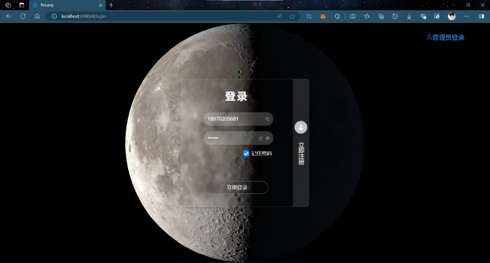
   ### 主界面
   
   ### 商品详情页面
   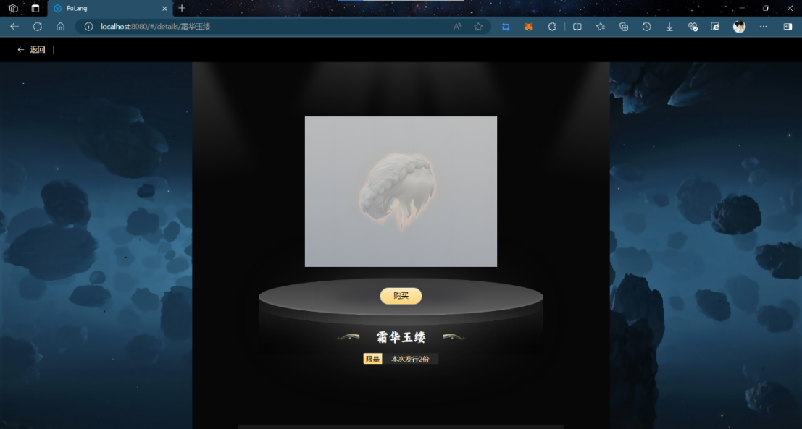
   ### 钱包页面
   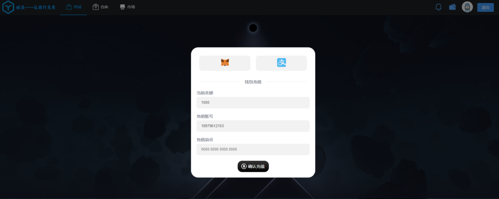
   ### 充值页面
   
   ### 购买页面
   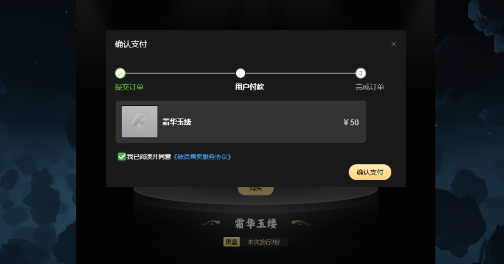
   ### 用户仓库页面
   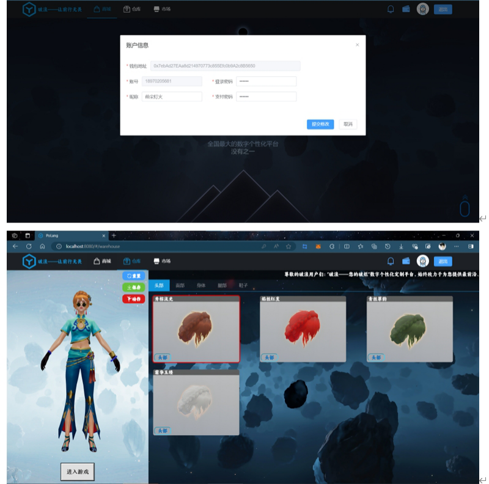
   ### 藏品出售页面
   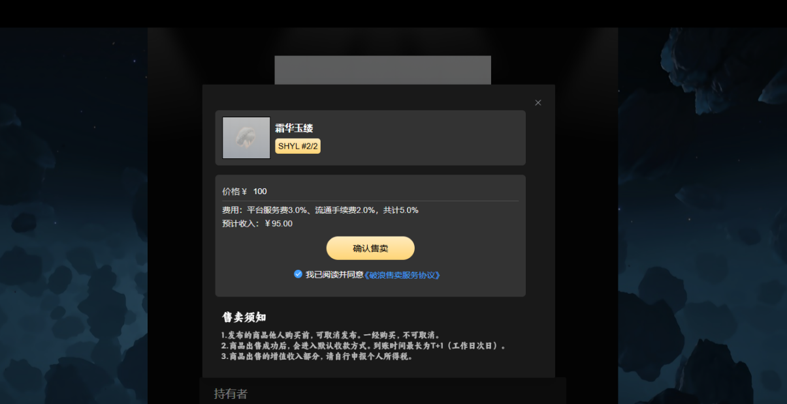
   ### 交易市场页面
   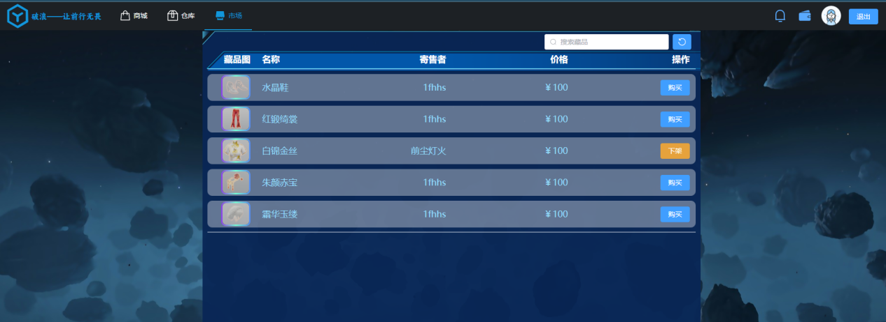
   ### 订单通知页面
   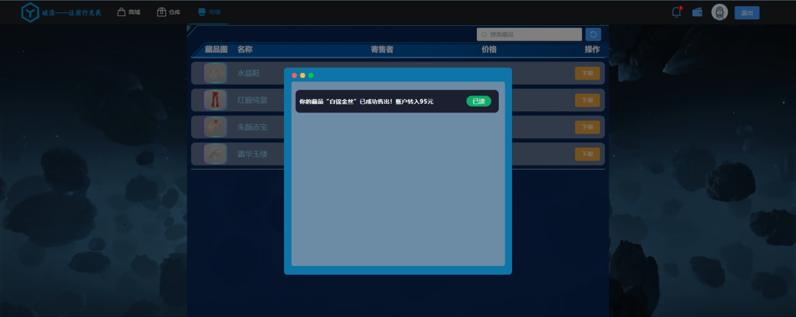
   ### 管理员页面
   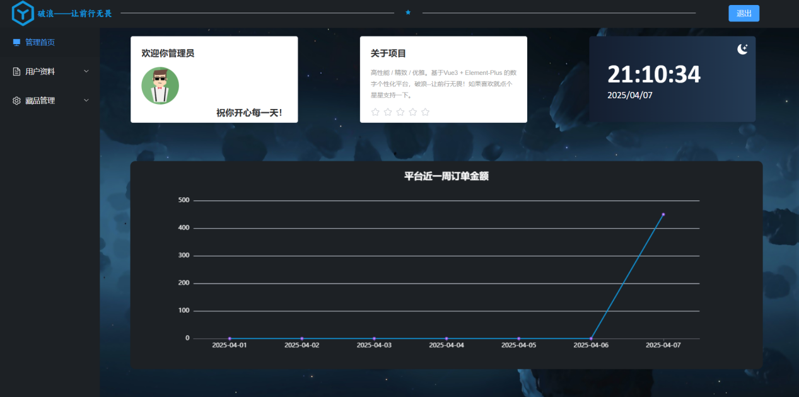
   ### 发布藏品页面
   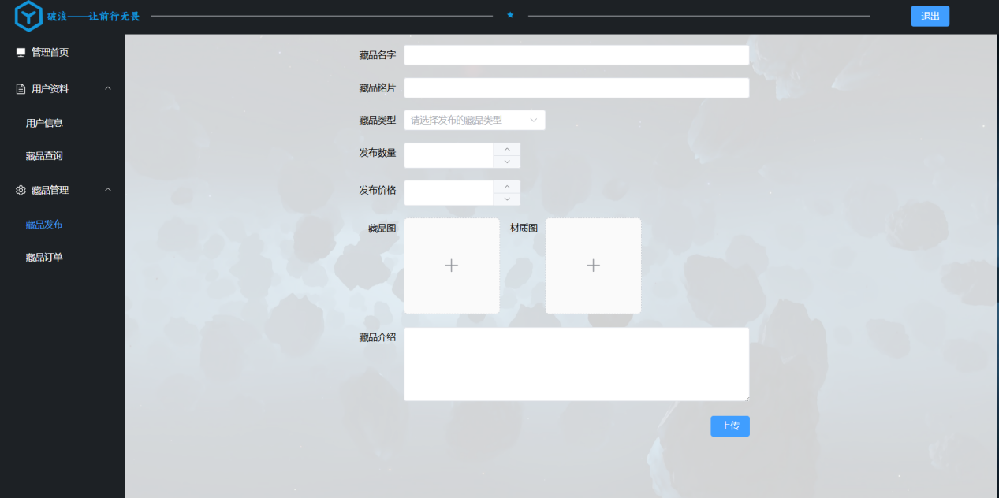
   ### 3D游戏展示效果
   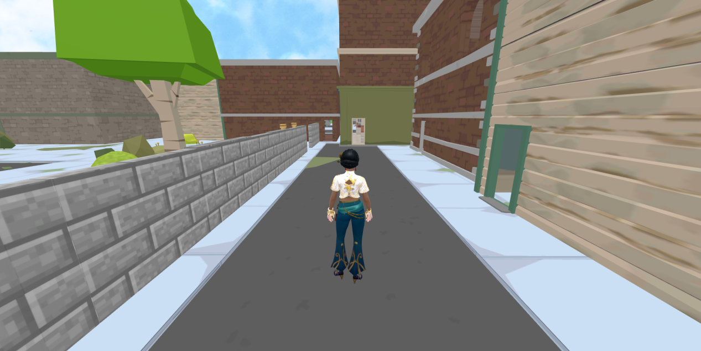

